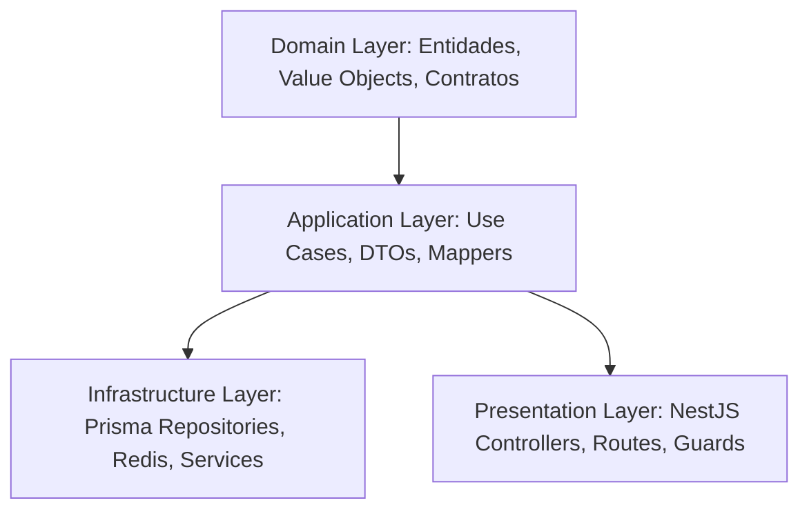

# Clean Architecture em NestJS/TypeScript

A arquitetura limpa foca na **independência de frameworks, testabilidade, independência de UI, de banco de dados e de agentes externos**.



---

## 1. As Camadas do Sistema

### 🛡️ Domínio (Domain) — O Core do Negócio

A camada mais interna. Contém as regras de negócio essenciais e não deve ter nenhuma dependência externa (nenhum import de NestJS, Prisma, Express, etc.).

- **Entidades (Entities)**: Objetos com identidade única que contêm lógica de negócio ativa.
- **Objetos de Valor (Value Objects)**: Objetos sem identidade, definidos por seus atributos (ex: CPF, Email, Senha).
- **Contratos (Interfaces)**: Definições abstratas de portas de saída (ex: `IUserRepository`).
- **Erros de Domínio**: Exceções específicas do negócio (ex: `BusinessRuleException`).

### ⚙️ Aplicação (Application) — Casos de Uso

Orquestra o fluxo de dados de e para as entidades de domínio.

- **Casos de Uso (Use Cases)**: Representam uma única ação do sistema (ex: `CreateAppointmentUseCase`). Cada caso de uso implementa o padrão Command ou executa uma única tarefa do usuário.
- **DTOs (Data Transfer Objects)**: Estruturas simples para transportar dados de entrada e saída.
- **Mappers**: Convertem dados entre a camada de Domínio, DTOs e persistência.

### 💾 Infraestrutura (Infrastructure) — Detalhes Tecnológicos

Implementações concretas de serviços e persistência.

- **Repositórios Prisma**: Acesso real ao banco de dados implementando as interfaces de Domínio.
- **Gateways & Providers**: Integração com serviços de terceiros (ex: SMS, Email, Stripe).
- **Cache & Redis**: Implementações concretas de caching e controle de concorrência.

### 🌐 Apresentação (Presentation) — Entrada/Saída

Ponto de entrada da aplicação.

- **Controllers NestJS / Express**: Recebem requisições HTTP, delegam para os Use Cases e retornam a resposta.
- **Validations (Zod/Joi)**: Validação rápida do formato de entrada antes de passar para a camada de aplicação.
- **Guards & Middlewares**: Autenticação, Autorização (RBAC), Rate Limiting.

---

## 2. Exemplo Prático: Agendamento de Serviço (Cabeleleila Leila)

### Domínio: Entidade e Contrato de Repositório

```typescript
// src/modules/appointments/domain/entities/appointment.entity.ts
export interface AppointmentProps {
  id?: string;
  clientId: string;
  serviceId: string;
  scheduledAt: Date;
  status: 'PENDING' | 'CONFIRMED' | 'CANCELLED';
  createdAt?: Date;
}

export class Appointment {
  private props: AppointmentProps;

  private constructor(props: AppointmentProps) {
    this.props = {
      ...props,
      id: props.id || crypto.randomUUID(),
      status: props.status || 'PENDING',
      createdAt: props.createdAt || new Date(),
    };
  }

  public static create(props: AppointmentProps): Appointment {
    if (props.scheduledAt < new Date()) {
      throw new DomainError('Não é possível agendar em uma data passada.');
    }
    return new Appointment(props);
  }

  public confirm(): void {
    this.props.status = 'CONFIRMED';
  }

  public cancel(): void {
    this.props.status = 'CANCELLED';
  }

  // Getters
  get id() {
    return this.props.id!;
  }
  get clientId() {
    return this.props.clientId;
  }
  get serviceId() {
    return this.props.serviceId;
  }
  get scheduledAt() {
    return this.props.scheduledAt;
  }
  get status() {
    return this.props.status;
  }
}

// src/modules/appointments/domain/repositories/appointment.repository.ts
export interface IAppointmentRepository {
  save(appointment: Appointment): Promise<Appointment>;
  findById(id: string): Promise<Appointment | null>;
  findConflicting(scheduledAt: Date): Promise<Appointment | null>;
}
```

### Aplicação: Caso de Uso e DTO

```typescript
// src/modules/appointments/application/dtos/create-appointment.dto.ts
export interface CreateAppointmentInput {
  clientId: string;
  serviceId: string;
  scheduledAt: string;
}

export interface CreateAppointmentOutput {
  id: string;
  status: string;
  scheduledAt: Date;
}

// src/modules/appointments/application/use-cases/create-appointment.use-case.ts
import { Appointment } from '../../domain/entities/appointment.entity';
import { IAppointmentRepository } from '../../domain/repositories/appointment.repository';

export class CreateAppointmentUseCase {
  constructor(private readonly appointmentRepository: IAppointmentRepository) {}

  async execute(input: CreateAppointmentInput): Promise<CreateAppointmentOutput> {
    const scheduledAt = new Date(input.scheduledAt);

    // Valida conflito de horário
    const conflicting = await this.appointmentRepository.findConflicting(scheduledAt);
    if (conflicting) {
      throw new ConflictException('Horário já ocupado por outro agendamento.');
    }

    const appointment = Appointment.create({
      clientId: input.clientId,
      serviceId: input.serviceId,
      scheduledAt,
      status: 'PENDING',
    });

    await this.appointmentRepository.save(appointment);

    return {
      id: appointment.id,
      status: appointment.status,
      scheduledAt: appointment.scheduledAt,
    };
  }
}
```

### Infraestrutura: Repositório Concreto com Prisma

```typescript
// src/modules/appointments/infrastructure/repositories/prisma-appointment.repository.ts
import { PrismaClient } from '@prisma/client';
import { Appointment } from '../../domain/entities/appointment.entity';
import { IAppointmentRepository } from '../../domain/repositories/appointment.repository';

export class PrismaAppointmentRepository implements IAppointmentRepository {
  constructor(private readonly prisma: PrismaClient) {}

  async save(appointment: Appointment): Promise<Appointment> {
    const data = {
      id: appointment.id,
      clientId: appointment.clientId,
      serviceId: appointment.serviceId,
      scheduledAt: appointment.scheduledAt,
      status: appointment.status,
    };

    await this.prisma.appointment.upsert({
      where: { id: data.id },
      update: data,
      create: data,
    });

    return appointment;
  }

  async findById(id: string): Promise<Appointment | null> {
    const raw = await this.prisma.appointment.findUnique({ where: { id } });
    if (!raw) return null;
    return Appointment.create(raw);
  }

  async findConflicting(scheduledAt: Date): Promise<Appointment | null> {
    const raw = await this.prisma.appointment.findFirst({
      where: { scheduledAt, status: 'CONFIRMED' },
    });
    if (!raw) return null;
    return Appointment.create(raw);
  }
}
```

---

## 3. Checklist Clean Architecture

- [ ] **Desacoplamento do Framework**: A lógica de domínio ou aplicação não possui imports `@nestjs/common`, `@nestjs/injectable`, etc.
- [ ] **Camadas respeitadas**: O Domínio não importa nada de fora. A Aplicação importa apenas de Domínio. A Infraestrutura e Apresentação importam de Aplicação e Domínio.
- [ ] **Inversão de Dependências (DIP)**: Use cases dependem de interfaces (`IAppointmentRepository`), não de classes concretas (`PrismaAppointmentRepository`).
- [ ] **Mappers**: A infraestrutura mapeia dados de persistência para entidades de domínio ao carregar, e de domínio para persistência ao salvar.
