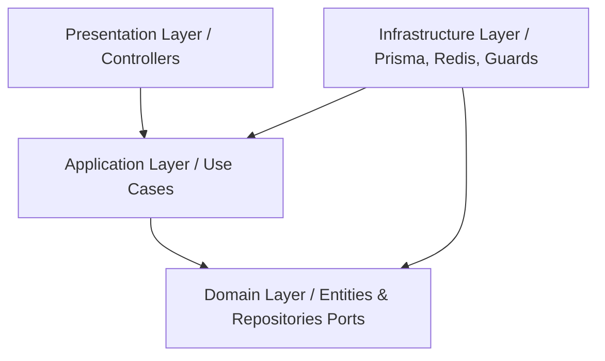

# Arquitetura do Sistema — Cabeleleila Leila

> Especificação da estrutura de diretórios, monorepo e camadas lógicas baseadas em Clean Architecture e boas práticas de engenharia de software.

---

## 1. Estrutura do Monorepo (Turborepo)

O projeto é estruturado como um monorepo gerenciado pelo **Turborepo** para facilitar o compartilhamento de código (interfaces, tipos, utilitários, configurações de lint/formatação e biblioteca de componentes UI) entre o frontend (Angular) e o backend (NestJS).

```
desafio_dsin/
├── apps/
│   ├── api/                 # Backend NestJS (Clean Architecture)
│   └── web/                 # Frontend Angular 21 (Tailwind + )
├── packages/
│   ├── ui/                  # Biblioteca de componentes visuais baseada em /Tailwind
│   └── eslint-config/       # Configurações de Lint e Prettier compartilhadas
├── docs/
│   ├── specs/               # Especificações de requisitos e plano de execução (PRD, Spec)
│   └── design/              # Arquivos de design de software (Arquitetura, Banco de Dados, APIs, UI/UX)
├── docker-compose.yml       # Orquestração local (PostgreSQL, Redis, API, Web)
├── package.json             # Raiz do workspace npm
└── turbo.json               # Configurações de pipeline do Turborepo
```

---

## 2. Backend Architecture (NestJS + Clean Architecture)

O backend é implementado na pasta `apps/api/` usando os princípios de **Clean Architecture**, isolando as regras de negócio de detalhes de infraestrutura (como banco de dados, ORMs, frameworks web e bibliotecas externas).

### Camadas Lógicas



#### A. Domain (Núcleo Puro)
* **Objetivo:** Contém as regras de negócio mais essenciais e as entidades fundamentais do sistema. É 100% puro TypeScript, livre de dependências de NestJS, Prisma ou qualquer biblioteca externa de framework.
* **Conteúdo:**
  * `domain/entities/`: Entidades de domínio ricas (validação de dados internos, máquina de estados).
  * `domain/repositories/`: Interfaces (portas de saída) que descrevem as operações necessárias no banco de dados (ex: `IUsuarioRepository`).
  * `domain/exceptions/`: Exceções de domínio específicas do negócio (ex: `ConflitoAgendamentoException`).

#### B. Application (Casos de Uso)
* **Objetivo:** Orquestra o fluxo de dados de e para a camada de domínio, aplicando regras de negócio específicas para cada caso de uso da aplicação.
* **Conteúdo:**
  * `application/use-cases/`: Implementações de casos de uso específicos (ex: `RegistrarUsuarioUseCase`, `CriarAgendamentoUseCase`).
  * `application/dtos/`: DTOs de entrada e saída do caso de uso.

#### C. Infrastructure (Detalhes de Implementação)
* **Objetivo:** Contém as ferramentas concretas para persistência, mensageria, segurança e outras integrações externas.
* **Conteúdo:**
  * `infrastructure/repositories/`: Implementações concretas de repositórios usando o Prisma ORM (ex: `PrismaUsuarioRepository`).
  * `infrastructure/database/`: Módulos de conexão do Prisma, seeds e migrations.
  * `infrastructure/security/`: Estratégias de JWT, hashing de senhas com Argon2, Guards e Decorators.
  * `infrastructure/cache/`: Módulo de conexão com o Redis.

#### D. Presentation (Interface Externa)
* **Objetivo:** Expõe os pontos de entrada do sistema para o mundo exterior (HTTP REST, WebSockets, CLI).
* **Conteúdo:**
  * `presentation/controllers/`: Controllers NestJS responsáveis por mapear rotas HTTP, validar inputs com `Zod` e classificar status HTTP (ex: `AuthController`, `AgendamentosController`).
  * `presentation/interceptors/`: Formatação de respostas, loggers e tratamento global de erros.

---

## 3. Frontend Architecture (Angular 21 + Signals + Tailwind)

O frontend é construído sob uma abordagem modular, baseada em estado reativo com **Angular Signals** e componentes utilitários estilizados com **Tailwind CSS** e ****.

### Estrutura de Diretórios (`apps/web/`)
```
apps/web/src/app/
├── core/
│   ├── guards/              # Proteção de rotas (AuthGuard, RoleGuard)
│   ├── interceptors/        # Injeção de JWT nas requisições, tratamento de erros 401/403
│   └── services/            # Serviços de comunicação base com API (ApiService)
├── store/
│   └── auth.store.ts        # Gerenciamento global de autenticação com Signals/NgRx
├── features/
│   ├── auth/                # Módulo de Autenticação (Login, Registro, Recuperação)
│   ├── cliente/             # Área do Cliente (Catálogo, Fluxo de Agendamento, Meus Agendamentos)
│   └── admin/               # Área Administrativa (Dashboard, Gestão de Serviços, Grade Semanal)
└── shared/
    ├── components/          # Componentes reaproveitáveis (modais, botões customizados)
    └── pipes/               # Formatação de preços, durações e datas em português
```

### State Management (`AuthStore`)
O estado de autenticação é centralizado no `AuthStore` usando os primitivos de reatividade nativos do Angular (**Signals**). Isso simplifica a reatividade na interface e garante que mudanças de estado (como logout ou atualização do token) reflitam instantaneamente em toda a aplicação.

```typescript
// Estrutura conceitual do AuthStore
export const AuthStore = signalStore(
  { providedIn: 'root' },
  withState({
    user: null as Usuario | null,
    accessToken: null as string | null,
    loading: false,
    error: null as string | null,
  }),
  withComputed(({ user }) => ({
    isAuthenticated: computed(() => !!user()),
    isAdmin: computed(() => user()?.role === 'ADMIN'),
  })),
  withMethods((store, apiService = inject(ApiService)) => ({
    // login, logout, refresh, updateProfile...
  }))
);
```

---

## 4. Estratégia de Comunicação & Segurança

### Autenticação JWT com Cookie Rotativo
1. **Access Token (JWT curto - 15 min):** Enviado no corpo da resposta na rota de login e armazenado em memória (no `AuthStore`) do Angular. Deve ser incluído no cabeçalho `Authorization: Bearer <token>` em todas as requisições HTTP do cliente.
2. **Refresh Token (JWT longo - 7 dias):** Armazenado no banco de dados e retornado pelo backend como um cookie seguro `HttpOnly` (`__Host-refresh-token`). O frontend nunca tem acesso a este token via Javascript, mitigando ataques do tipo XSS (Cross-Site Scripting).
3. **Fluxo de Refresh Automático:** O interceptor HTTP do Angular monitora respostas com status `401 Unauthorized`. Caso detectado, ele pausa temporariamente as requisições pendentes, chama a rota `/auth/refresh` (que valida o cookie `HttpOnly`), recebe o novo par de tokens e repete as requisições originais de forma transparente ao usuário.

### Proteção de Rotas (RBAC)
* **Backend:** Uso combinado de `@UseGuards(JwtAuthGuard, RolesGuard)` e do decorator personalizado `@Roles('ADMIN')`.
* **Frontend:** Guards de rotas (`AuthGuard` e `RoleGuard`) vinculados aos seletores computados do `AuthStore` (`isAuthenticated` e `isAdmin`) para bloquear transições de rotas antes do carregamento do template Angular.
