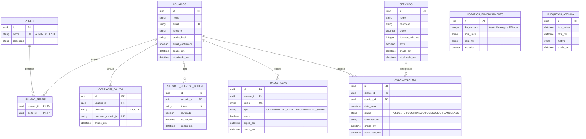

# Modelagem do Banco de Dados — Cabeleleila Leila

> Especificação detalhada do esquema do banco de dados relacional PostgreSQL modelado através do Prisma ORM.

---

## 1. Visão Geral do Modelo Relacional

O banco de dados é projetado para garantir a integridade dos dados, relações eficientes, e consultas rápidas por meio de indexação nos campos mais pesquisados (como e-mails, chaves primárias e datas).



---

## 2. Dicionário de Dados & Tabelas

### A. Módulo IAM (Gestão de Identidade e Acesso)

#### Tabela `usuarios`
* Guarda informações essenciais do cadastro de pessoas.
* **Índices:** Unique em `email`.

#### Tabela `perfis`
* Define os perfis disponíveis no sistema (`ADMIN`, `CLIENTE`).
* **Índices:** Unique em `nome`.

#### Tabela `usuario_perfis`
* Tabela pivot de associação muitos-para-muitos entre `usuarios` e `perfis`.
* **Chave Primária Composta:** `(usuario_id, perfil_id)`.

#### Tabela `conexoes_oauth`
* Vincula logins externos (ex: Google OAuth2).
* **Chave Única:** `(provedor, provedor_usuario_id)`.

#### Tabela `sessoes_refresh_token`
* Armazena os Refresh Tokens ativos para controle de sessões e Rotação de Token (RTR).
* **Índices:** Unique em `token`, Index em `usuario_id`.

#### Tabela `tokens_acao`
* Registra os tokens gerados para fluxos de recuperação de senha e confirmação de e-mail.
* **Índices:** Unique em `token`.

---

### B. Módulo Catálogo (Serviços e Horários)

#### Tabela `servicos`
* Guarda a ficha técnica dos serviços prestados (corte de cabelo, manicure, etc.).
* **Índices:** Index em `ativo` para buscas rápidas.

#### Tabela `horarios_funcionamento`
* Configura as horas úteis de trabalho do salão para cada dia da semana (0 = Domingo, 1 = Segunda, etc.).
* **Chave Única:** `dia_semana`.

#### Tabela `bloqueios_agenda`
* Determina períodos em que o salão estará inoperante (feriados, férias, manutenção).
* **Índices:** Index sobre `(data_inicio, data_fim)`.

---

### C. Módulo Agendamentos

#### Tabela `agendamentos`
* Liga o cliente ao serviço na data/hora desejada.
* **Validações:** `data_hora` não pode conflitar com outro agendamento ativo para a mesma hora útil considerando a duração do serviço.
* **Índices:** Index composto `(data_hora, status)` e index em `cliente_id`.

---

## 3. Schema Prisma Conceitual (`schema.prisma`)

Abaixo está o modelo completo em sintaxe Prisma que atende a todos os requisitos.

```prisma
datasource db {
  provider = "postgresql"
  url      = env("DATABASE_URL")
}

generator client {
  provider = "prisma-client-js"
}

// -------------------------------------------------------------
// ENUMS
// -------------------------------------------------------------

enum TipoTokenAcao {
  CONFIRMACAO_EMAIL
  RECUPERACAO_SENHA
}

enum StatusAgendamento {
  PENDENTE
  CONFIRMADO
  CONCLUIDO
  CANCELADO
}

// -------------------------------------------------------------
// MODELS (IAM)
// -------------------------------------------------------------

model Usuario {
  id               String            @id @default(uuid()) @db.Uuid
  nome             String            @db.VarChar(150)
  email            String            @unique @db.VarChar(150)
  telefone         String?           @db.VarChar(20)
  senhaHash        String?           @map("senha_hash") @db.VarChar(255)
  emailConfirmado  Boolean           @default(false) @map("email_confirmado")
  criadoEm         DateTime          @default(now()) @map("criado_em")
  atualizadoEm     DateTime          @updatedAt @map("atualizado_em")
  
  perfis           UsuarioPerfil[]
  conexoesOauth    ConexaoOauth[]
  refreshTokens    SessaoRefreshToken[]
  tokensAcao       TokenAcao[]
  agendamentos     Agendamento[]

  @@map("usuarios")
}

model Perfil {
  id        String          @id @default(uuid()) @db.Uuid
  nome      String          @unique @db.VarChar(50) // ADMIN | CLIENTE
  descricao String?         @db.VarChar(255)
  usuarios  UsuarioPerfil[]

  @@map("perfis")
}

model UsuarioPerfil {
  usuarioId String  @map("usuario_id") @db.Uuid
  perfilId  String  @map("perfil_id") @db.Uuid
  usuario   Usuario @relation(fields: [usuarioId], references: [id], onDelete: Cascade)
  perfil    Perfil  @relation(fields: [perfilId], references: [id], onDelete: Cascade)

  @@id([usuarioId, perfilId])
  @@map("usuario_perfis")
}

model ConexaoOauth {
  id                String   @id @default(uuid()) @db.Uuid
  usuarioId         String   @map("usuario_id") @db.Uuid
  provedor          String   @db.VarChar(50) // ex: GOOGLE
  provedorUsuarioId String   @unique @map("provedor_usuario_id") @db.VarChar(255)
  criadoEm          DateTime @default(now()) @map("criado_em")
  
  usuario           Usuario  @relation(fields: [usuarioId], references: [id], onDelete: Cascade)

  @@map("conexoes_oauth")
}

model SessaoRefreshToken {
  id        String   @id @default(uuid()) @db.Uuid
  usuarioId String   @map("usuario_id") @db.Uuid
  token     String   @unique @db.VarChar(500)
  revogado  Boolean  @default(false)
  expiraEm  DateTime @map("expira_em")
  criadoEm  DateTime @default(now()) @map("criado_em")
  
  usuario   Usuario  @relation(fields: [usuarioId], references: [id], onDelete: Cascade)

  @@index([usuarioId])
  @@map("sessoes_refresh_token")
}

model TokenAcao {
  id        String        @id @default(uuid()) @db.Uuid
  usuarioId String        @map("usuario_id") @db.Uuid
  token     String        @unique @db.VarChar(255)
  tipo      TipoTokenAcao
  usado     Boolean       @default(false)
  expiraEm  DateTime      @map("expira_em")
  criadoEm  DateTime      @default(now()) @map("criado_em")
  
  usuario   Usuario       @relation(fields: [usuarioId], references: [id], onDelete: Cascade)

  @@map("tokens_acao")
}

// -------------------------------------------------------------
// MODELS (CATÁLOGO)
// -------------------------------------------------------------

model Servico {
  id             String        @id @default(uuid()) @db.Uuid
  nome           String        @db.VarChar(100)
  descricao      String?       @db.Text
  preco          Decimal       @db.Decimal(10, 2)
  duracaoMinutos Int           @map("duracao_minutos")
  ativo          Boolean       @default(true)
  criadoEm       DateTime      @default(now()) @map("criado_em")
  atualizadoEm   DateTime      @updatedAt @map("atualizado_em")
  
  agendamentos   Agendamento[]

  @@index([ativo])
  @@map("servicos")
}

model HorarioFuncionamento {
  id        String  @id @default(uuid()) @db.Uuid
  diaSemana Int     @unique @map("dia_semana") // 0 (Domingo) a 6 (Sábado)
  horaInicio String  @map("hora_inicio") @db.VarChar(5) // ex: "08:00"
  horaFim    String  @map("hora_fim") @db.VarChar(5)    // ex: "18:00"
  fechado   Boolean @default(false)

  @@map("horarios_funcionamento")
}

model BloqueioAgenda {
  id         String   @id @default(uuid()) @db.Uuid
  dataInicio DateTime @map("data_inicio")
  dataFim    DateTime @map("data_fim")
  motivo     String   @db.VarChar(255)
  criadoEm   DateTime @default(now()) @map("criado_em")

  @@index([dataInicio, dataFim])
  @@map("bloqueios_agenda")
}

// -------------------------------------------------------------
// MODELS (AGENDAMENTOS)
// -------------------------------------------------------------

model Agendamento {
  id           String            @id @default(uuid()) @db.Uuid
  clienteId    String            @map("cliente_id") @db.Uuid
  servicoId    String            @map("servico_id") @db.Uuid
  dataHora     DateTime          @map("data_hora")
  status       StatusAgendamento @default(PENDENTE)
  observacoes  String?           @db.Text
  criadoEm     DateTime          @default(now()) @map("criado_em")
  atualizadoEm DateTime          @updatedAt @map("atualizado_em")
  
  cliente      Usuario           @relation(fields: [clienteId], references: [id], onDelete: Cascade)
  servico      Servico           @relation(fields: [servicoId], references: [id], onDelete: Restrict)

  @@index([dataHora, status])
  @@index([clienteId])
  @@map("agendamentos")
}
```
