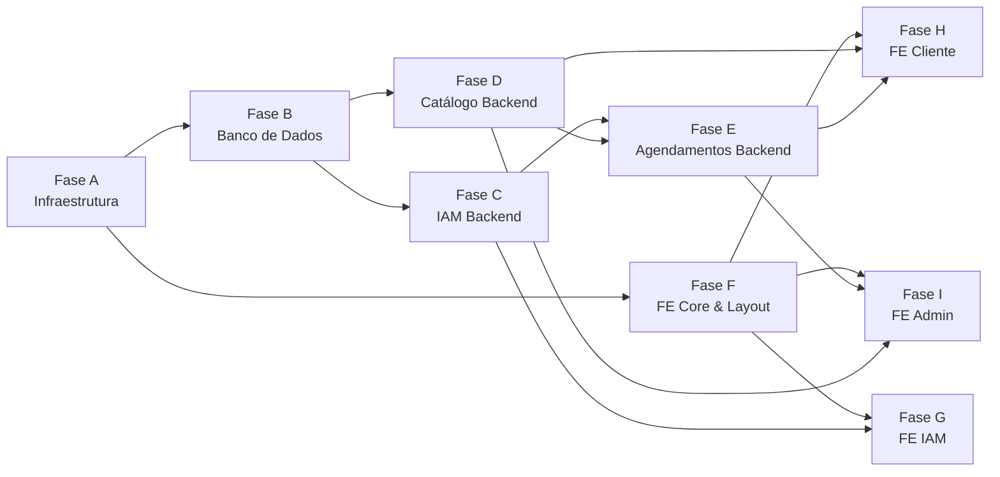

# Plano de Execução — Cabeleleila Leila

> **Sistema de Agendamentos Online e Gestão de Salão de Beleza**
>
> Este documento é a especificação (.spec) oficial do plano de execução do projeto. Ele mapeia todas as etapas de desenvolvimento, desde a infraestrutura inicial até as telas do painel administrativo.

---

## 📌 Convenções

| Símbolo | Significado |
|---------|-------------|
| 🟢 | Tarefa independente (pode iniciar sem esperar outras) |
| 🔗 | Tem dependência (ver coluna "Depende de") |
| **BE** | Backend (NestJS) |
| **FE** | Frontend (Angular 21) |
| **INFRA** | Infraestrutura / DevOps |
| **DB** | Banco de Dados |

---

## Fase A — Infraestrutura & Monorepo

> **Objetivo:** Ter o esqueleto do projeto rodando com Docker, Turbo Repo e as apps vazias conectadas.

| ID | Descrição | Tipo | Depende de | Entregáveis | Critério de Aceite |
|----|-----------|------|------------|-------------|-------------------|
| **A-1** | Inicializar repositório Git + `.gitignore` + `README.md` com visão geral do projeto | INFRA | 🟢 | Repo inicializado, `.gitignore` para Node/Angular/Docker | `git log` mostra commit inicial |
| **A-2** | Criar estrutura Turbo Repo (`turbo.json`, `package.json` raiz, workspaces `apps/` e `packages/`) | INFRA | A-1 | `turbo.json` configurado com pipelines `build`, `dev`, `lint`, `test` | `npx turbo run build` executa sem erro (mesmo vazio) |
| **A-3** | Scaffold do app NestJS em `apps/api/` com Clean Architecture (pastas `domain/`, `application/`, `infrastructure/`, `presentation/`) | BE | A-2 | App NestJS rodando com endpoint health-check `GET /health` | `curl localhost:3000/health` → `{ "status": "ok" }` |
| **A-4** | Scaffold do app Angular 21 em `apps/web/` com Tailwind CSS configurado | FE | A-2 | App Angular rodando com página inicial placeholder | `ng serve` abre no browser sem erros |
| **A-5** | Instalar e configurar  no projeto Angular + criar pacote `packages/ui/` | FE | A-4 | Componentes Spartan disponíveis, botão de exemplo renderiza | Componente `<hlm-button>` renderiza corretamente |
| **A-6** | Criar `docker-compose.yml` com serviços: `postgres`, `redis`, `api`, `web` | INFRA | A-3, A-4 | Docker Compose funcional com hot-reload | `docker compose up` sobe todos os serviços |
| **A-7** | Configurar ESLint + Prettier no pacote `packages/eslint-config/` e integrar no Turbo | INFRA | A-2 | Config compartilhada de lint | `npx turbo run lint` roda em todos os workspaces |
| **A-8** | Configurar variáveis de ambiente (`.env.example`, `ConfigModule` do NestJS, `environment.ts` do Angular) | INFRA | A-3, A-4 | `.env.example` documentado, NestJS lê variáveis via `ConfigModule` | App sobe lendo `DATABASE_URL` e `REDIS_URL` do `.env` |

---

## Fase B — Banco de Dados & ORM

> **Objetivo:** Ter todas as tabelas criadas, migrations versionadas e seeds básicos.

| ID | Descrição | Tipo | Depende de | Entregáveis | Critério de Aceite |
|----|-----------|------|------------|-------------|-------------------|
| **B-1** | Instalar e configurar Prisma ORM no `apps/api/` conectando ao PostgreSQL | DB/BE | A-3, A-6 | `schema.prisma` com datasource configurado | `npx prisma db push` conecta e sincroniza |
| **B-2** | Modelar tabelas do **Módulo IAM**: `usuarios`, `perfis`, `usuario_perfis`, `conexoes_oauth`, `sessoes_refresh_token`, `tokens_acao` | DB | B-1 | Schema Prisma com todos os models, relações e índices | `npx prisma migrate dev` cria migration sem erro |
| **B-3** | Modelar tabelas do **Módulo Catálogo**: `servicos`, `horarios_funcionamento`, `bloqueios_agenda` | DB | B-1 | Models no schema Prisma com validações de tipo | Migration aplica sem erro |
| **B-4** | Modelar tabela do **Módulo Agendamentos**: `agendamentos` com FKs para `usuarios` e `servicos` | DB | B-2, B-3 | Model com enum de status e relações | Migration aplica, FK constraints validadas |
| **B-5** | Criar seed script com: perfis `ADMIN`/`CLIENTE`, usuário admin padrão, serviços de exemplo, horários de funcionamento padrão | DB | B-4 | `prisma/seed.ts` executável | `npx prisma db seed` popula dados corretamente |

---

## Fase C — Módulo IAM (Backend)

> **Objetivo:** Autenticação completa com JWT, refresh token, OAuth2 Google e RBAC.

| ID | Descrição | Tipo | Depende de | Entregáveis | Critério de Aceite |
|----|-----------|------|------------|-------------|-------------------|
| **C-1** | Criar **entidades de domínio** (`Usuario`, `Perfil`, `RefreshToken`, `TokenAcao`) com regras de negócio | BE | B-2 | Classes em `domain/entities/` com validações | Testes unitários passam |
| **C-2** | Criar **repositórios abstratos** (interfaces/ports) para cada entidade IAM em `domain/repositories/` | BE | C-1 | Interfaces `IUsuarioRepository`, `IPerfilRepository`, etc. | Interfaces exportadas sem dependência de Prisma |
| **C-3** | Implementar **repositórios concretos** com Prisma em `infrastructure/repositories/` | BE | C-2, B-2 | Implementações Prisma de cada repositório | Queries executam corretamente contra o DB |
| **C-4** | Implementar use case **Registrar Usuário** (hash de senha com Argon2, atribuição do perfil CLIENTE, geração de token de confirmação) | BE | C-3 | Use case em `application/use-cases/` | `POST /auth/register` cria usuário com senha hasheada |
| **C-5** | Implementar use case **Login** (validar credenciais, gerar JWT access token + refresh token em cookie HttpOnly) | BE | C-4 | Use case + `JwtStrategy` configurada | `POST /auth/login` retorna JWT e seta cookie |
| **C-6** | Implementar use case **Refresh Token** (rotação de refresh token, invalidação do antigo) | BE | C-5 | Endpoint `POST /auth/refresh` | Token antigo é revogado, novo par JWT+RT emitido |
| **C-7** | Implementar use case **Logout** (revogar refresh token ativo) | BE | C-5 | Endpoint `POST /auth/logout` | Refresh token marcado como `revogado = true` |
| **C-8** | Implementar **Guard de Autenticação** (JWT) e **Guard de Autorização** (RBAC por perfil) | BE | C-5 | `@UseGuards(JwtAuthGuard)` e decorator `@Roles('ADMIN')` | Rotas protegidas retornam 401/403 corretamente |
| **C-9** | Implementar **Rate Limiting** com Redis (`@nestjs/throttler`) nas rotas `/auth/*` | BE | C-5, A-6 | ThrottlerModule configurado com Redis store | Após N requests, retorna 429 Too Many Requests |
| **C-10** | Implementar use case **Recuperar Senha** (gerar token, enviar e-mail simulado/log) | BE | C-3 | Endpoints `POST /auth/forgot-password` e `POST /auth/reset-password` | Token gerado, senha atualizada com token válido |
| **C-11** | Implementar use case **Confirmar E-mail** (validar token de confirmação) | BE | C-3 | Endpoint `GET /auth/confirm-email?token=xxx` | `email_confirmado` atualizado para `true` |
| **C-12** | Implementar fluxo **OAuth2 Google** (redirect, callback, criação/vinculação de usuário, emissão de JWT) | BE | C-5 | Endpoints `GET /auth/google` e `GET /auth/google/callback` | Login via Google cria usuário e retorna JWT |
| **C-13** | Implementar endpoint **Perfil do Usuário** (`GET /users/me`, `PATCH /users/me`) | BE | C-8 | Controller com rotas protegidas | Usuário autenticado consulta e edita próprio perfil |

---

## Fase D — Módulo Catálogo (Backend)

> **Objetivo:** CRUD completo de serviços, horários de funcionamento e bloqueios de agenda.

| ID | Descrição | Tipo | Depende de | Entregáveis | Critério de Aceite |
|----|-----------|------|------------|-------------|-------------------|
| **D-1** | Criar entidades de domínio: `Servico`, `HorarioFuncionamento`, `BloqueioAgenda` | BE | B-3 | Classes com validações de negócio | Testes unitários passam |
| **D-2** | Criar repositórios (interfaces + implementações Prisma) para o módulo Catálogo | BE | D-1, B-3 | Repositórios funcionais | Operações CRUD executam contra o DB |
| **D-3** | Implementar **CRUD de Serviços** (`GET`, `POST`, `PUT`, `PATCH /ativo`, `DELETE`) — rotas admin protegidas | BE | D-2, C-8 | Controller `ServicosController` | Admin cria/edita/desativa serviços; clientes só listam ativos |
| **D-4** | Implementar **CRUD de Horários de Funcionamento** — rotas admin protegidas | BE | D-2, C-8 | Controller `HorariosFuncionamentoController` | Admin configura horários por dia da semana |
| **D-5** | Implementar **CRUD de Bloqueios de Agenda** (férias, feriados, manutenção) — rotas admin protegidas | BE | D-2, C-8 | Controller `BloqueiosAgendaController` | Admin cria/remove bloqueios com motivo |
| **D-6** | Implementar endpoint público **Listar Horários Disponíveis** para uma data (`GET /disponibilidade?data=YYYY-MM-DD&servico_id=xxx`) | BE | D-2, D-3, D-4, D-5, B-4 | Service que cruza horários, bloqueios e agendamentos existentes | Retorna apenas slots livres considerando duração do serviço |

---

## Fase E — Módulo Agendamentos (Backend)

> **Objetivo:** Regra de negócios transacional de agendamento com validações de conflito.

| ID | Descrição | Tipo | Depende de | Entregáveis | Critério de Aceite |
|----|-----------|------|------------|-------------|-------------------|
| **E-1** | Criar entidade de domínio `Agendamento` com máquina de estados de status (`PENDENTE → CONFIRMADO → CONCLUIDO` / `→ CANCELADO`) | BE | B-4 | Classe com transições válidas e regras de cancelamento | Testes unitários cobrem transições válidas e inválidas |
| **E-2** | Criar repositório (interface + Prisma) para `Agendamento` | BE | E-1 | Repositório funcional com filtros por data, status e usuário | Queries executam corretamente |
| **E-3** | Implementar use case **Criar Agendamento** (validar disponibilidade, conflitos, horário de funcionamento, bloqueios) | BE | E-2, D-6 | Endpoint `POST /agendamentos` | Agendamento criado apenas se slot disponível; erro 409 se conflito |
| **E-4** | Implementar use case **Listar Agendamentos do Usuário** (com filtros de data e status) | BE | E-2, C-8 | Endpoint `GET /agendamentos` (filtra por usuário logado) | Cliente vê apenas seus agendamentos; admin vê todos |
| **E-5** | Implementar use case **Cancelar Agendamento** (regra: só cancela se status PENDENTE ou CONFIRMADO e com antecedência mínima) | BE | E-2, C-8 | Endpoint `PATCH /agendamentos/:id/cancelar` | Status muda para CANCELADO, slot liberado |
| **E-6** | Implementar use cases admin: **Confirmar** e **Concluir** agendamento | BE | E-2, C-8 | Endpoints `PATCH /agendamentos/:id/confirmar` e `/concluir` | Transições de status aplicadas corretamente |
| **E-7** | Implementar endpoint **Dashboard Admin** (agendamentos do dia, contadores por status, próximos agendamentos) | BE | E-2, C-8 | Endpoint `GET /admin/dashboard` | Retorna dados agregados do dia |

---

## Fase F — Frontend: Core, Layout & Design System

> **Objetivo:** Estrutura base do Angular com rotas, layout, tema e componentes reutilizáveis.

| ID | Descrição | Tipo | Depende de | Entregáveis | Critério de Aceite |
|----|-----------|------|------------|-------------|-------------------|
| **F-1** | Definir **design system** (paleta de cores, tipografia, espaçamentos) no `tailwind.config.ts` e variáveis CSS globais | FE | A-5 | Arquivo de config com tokens de design, fontes Google importadas | Classes utilitárias customizadas funcionam |
| **F-2** | Criar **layout principal** com Sidebar/Navbar responsivo (logo, menu, avatar do usuário) | FE | F-1 | Componente `LayoutComponent` com slots para conteúdo | Layout renderiza responsivamente em mobile e desktop |
| **F-3** | Configurar **roteamento** com lazy loading: rotas públicas (`/login`, `/register`, `/servicos`), rotas cliente (`/meus-agendamentos`, `/agendar`), rotas admin (`/admin/*`) | FE | F-2 | `app.routes.ts` com route guards placeholder | Navegação entre rotas funciona sem erro |
| **F-4** | Criar **serviço HTTP base** (`ApiService`) com interceptor para injetar JWT e tratar erros (401 → refresh, 403 → redirect) | FE | A-8 | `HttpInterceptor` configurado | Requests enviam header Authorization automaticamente |
| **F-5** | Criar **AuthStore** (state management com signals/NgRx) para gerenciar estado de autenticação, usuário logado e perfil | FE | F-4 | `AuthStore` com methods: `login()`, `logout()`, `refresh()`, `isAuthenticated$` | Estado persiste e atualiza reatividade |
| **F-6** | Implementar **AuthGuard** e **RoleGuard** para proteger rotas no Angular | FE | F-5 | Guards aplicados nas rotas | Usuário não autenticado é redirecionado para `/login` |

---

## Fase G — Frontend: Módulo IAM

> **Objetivo:** Telas de login, registro, recuperação de senha e perfil.

| ID | Descrição | Tipo | Depende de | Entregáveis | Critério de Aceite |
|----|-----------|------|------------|-------------|-------------------|
| **G-1** | Criar página de **Login** (formulário e-mail/senha, botão Google OAuth, link para registro) | FE | F-5, C-5 | Tela `/login` responsiva com validação de form | Login funcional com JWT retornado |
| **G-2** | Criar página de **Registro** (formulário nome, e-mail, telefone, senha com confirmação) | FE | F-5, C-4 | Tela `/register` com validações client-side | Registro cria conta e redireciona |
| **G-3** | Criar página de **Recuperar Senha** (solicitar e-mail) e **Redefinir Senha** (formulário com token) | FE | F-5, C-10 | Telas `/forgot-password` e `/reset-password` | Fluxo completo funcional |
| **G-4** | Criar página de **Perfil do Usuário** (ver e editar nome, telefone) | FE | F-5, C-13 | Tela `/perfil` com formulário de edição | Dados atualizados refletem no backend |
| **G-5** | Implementar **callback OAuth Google** (capturar token da URL, persistir no AuthStore) | FE | F-5, C-12 | Handler na rota `/auth/google/callback` | Login via Google funciona end-to-end |

---

## Fase H — Frontend: Área do Cliente

> **Objetivo:** Catálogo de serviços, fluxo de agendamento e gestão dos próprios agendamentos.

| ID | Descrição | Tipo | Depende de | Entregáveis | Critério de Aceite |
|----|-----------|------|------------|-------------|-------------------|
| **H-1** | Criar página **Catálogo de Serviços** (cards com nome, descrição, preço, duração, botão "Agendar") | FE | F-1, D-3 | Tela `/servicos` pública | Serviços ativos listados com layout responsivo |
| **H-2** | Criar **fluxo de agendamento — Step 1**: Selecionar serviço (se não veio do catálogo) | FE | H-1, F-6 | Componente de seleção de serviço | Serviço selecionado persiste no state do fluxo |
| **H-3** | Criar **fluxo de agendamento — Step 2**: Selecionar data no calendário (desabilitar dias sem horário/bloqueados) | FE | H-2, D-6 | Componente de calendário interativo | Datas indisponíveis aparecem desabilitadas |
| **H-4** | Criar **fluxo de agendamento — Step 3**: Selecionar horário disponível (slots retornados pela API) | FE | H-3 | Grid de horários clicáveis | Apenas slots livres são selecionáveis |
| **H-5** | Criar **fluxo de agendamento — Step 4**: Resumo + confirmação (serviço, data, hora, preço, campo observações) | FE | H-4, E-3 | Tela de confirmação com botão "Confirmar Agendamento" | Agendamento criado no backend ao confirmar |
| **H-6** | Criar página **Meus Agendamentos** (lista com filtros por status, ação de cancelar) | FE | F-6, E-4, E-5 | Tela `/meus-agendamentos` com tabela/cards | Lista agendamentos do usuário com opção de cancelar |

---

## Fase I — Frontend: Painel Administrativo

> **Objetivo:** Dashboard e telas de gestão para o administrador do salão.

| ID | Descrição | Tipo | Depende de | Entregáveis | Critério de Aceite |
|----|-----------|------|------------|-------------|-------------------|
| **I-1** | Criar **Dashboard Admin** (agendamentos do dia, contadores, próximos atendimentos) | FE | F-6, E-7 | Tela `/admin/dashboard` com cards e mini-tabela | Dados refletem informações reais do backend |
| **I-2** | Criar página **Gestão de Agendamentos** (tabela com todos os agendamentos, filtros, ações: confirmar, concluir, cancelar) | FE | F-6, E-4, E-6 | Tela `/admin/agendamentos` com DataTable interativa | Admin gerencia agendamentos com transições de status |
| **I-3** | Criar página **Gestão de Serviços** (CRUD visual com formulário modal) | FE | F-6, D-3 | Tela `/admin/servicos` com tabela + modal de edição | Admin cria, edita e desativa serviços |
| **I-4** | Criar página **Configurar Horários de Funcionamento** (grade semanal editável) | FE | F-6, D-4 | Tela `/admin/horarios` com grid de 7 dias | Admin configura horário de cada dia da semana |
| **I-5** | Criar página **Gerenciar Bloqueios** (calendário com bloqueios + formulário para adicionar) | FE | F-6, D-5 | Tela `/admin/bloqueios` com visualização de calendário | Admin adiciona/remove bloqueios com motivo |
| **I-6** | Criar página **Listagem de Usuários** (tabela com busca, visualizar perfil do cliente) | FE | F-6, C-13 | Tela `/admin/usuarios` com DataTable | Admin visualiza e pesquisa clientes cadastrados |

---

## 🗺️ Mapa de Dependências (Visão Geral)



---

## ⚡ Caminho Crítico (Ordem de Execução Recomendada)

```
A-1 → A-2 → A-3 + A-4 (paralelo)
         ↓
      A-6 (Docker)
         ↓
      B-1 → B-2 + B-3 (paralelo) → B-4 → B-5
         ↓
      C-1 → C-2 → C-3 → C-4 → C-5 → C-6...C-13
         ↓ (paralelo com C)
      D-1 → D-2 → D-3...D-6
         ↓
      E-1 → E-2 → E-3 → E-4...E-7

      // Frontend (pode iniciar em paralelo após A-4):
      F-1 → F-2 → F-3 → F-4 → F-5 → F-6
         ↓
      G-1...G-5 (após C estar pronto)
      H-1...H-6 (após D + E estarem prontos)
      I-1...I-6 (após E estar pronto)
```

---

## 📊 Resumo Quantitativo

| Fase | Qtd. Tarefas | Tipo Principal |
|------|:------------:|:--------------:|
| **A** — Infraestrutura | 8 | INFRA |
| **B** — Banco de Dados | 5 | DB |
| **C** — IAM Backend | 13 | BE |
| **D** — Catálogo Backend | 6 | BE |
| **E** — Agendamentos Backend | 7 | BE |
| **F** — FE Core & Layout | 6 | FE |
| **G** — FE IAM | 5 | FE |
| **H** — FE Área Cliente | 6 | FE |
| **I** — FE Painel Admin | 6 | FE |
| **TOTAL** | **62** | — |

---

## 🔑 Notas Importantes

> [!IMPORTANT]
> **Contexto por tarefa:** Cada tarefa foi dimensionada para caber em uma única sessão de agente. Ao receber uma tarefa, o agente deve ler **apenas** as dependências listadas para entender o contexto necessário.

> [!TIP]
> **Paralelismo:** As fases C e D do backend podem ser desenvolvidas **em paralelo** por agentes diferentes. O mesmo vale para F (FE Core) que pode iniciar junto com B (DB).

> [!WARNING]
> **Integrações críticas:** As tarefas D-6 (disponibilidade) e E-3 (criar agendamento) são as mais complexas pois cruzam dados de múltiplos módulos. Devem ser implementadas com atenção especial à concorrência e transações.

> [!CAUTION]
> **Segurança:** Nunca expor `senha_hash` em responses da API. Tokens OAuth e refresh tokens devem estar sempre em cookies HttpOnly. Rate limiting (C-9) deve ser implementado **antes** de expor a API publicamente.
