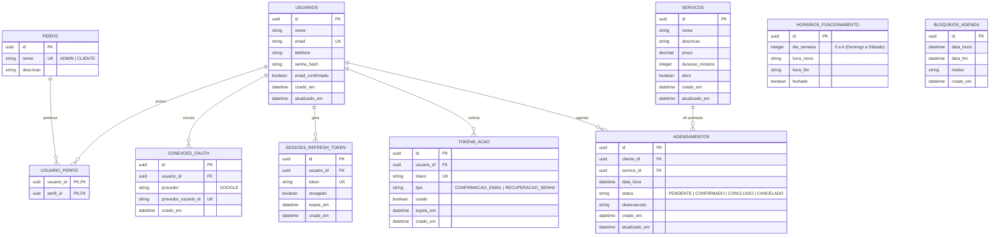

# Modelagem do Banco de Dados — Cabeleleila Leila

> Especificação detalhada do esquema do banco de dados relacional PostgreSQL com migrations SQL escritas à mão (sem ORM).

---

## 1. Visão Geral do Modelo Relacional

O banco de dados é projetado para garantir a integridade dos dados, relações eficientes, e consultas rápidas por meio de indexação nos campos mais pesquisados (como e-mails, chaves primárias e datas).



---

## 2. Dicionário de Dados & Tabelas

### A. Módulo IAM (Gestão de Identidade e Acesso)

#### Tabela `usuarios`

- Guarda informações essenciais do cadastro de pessoas.
- **Índices:** Unique em `email`.

#### Tabela `perfis`

- Define os perfis disponíveis no sistema (`ADMIN`, `CLIENTE`).
- **Índices:** Unique em `nome`.

#### Tabela `usuario_perfis`

- Tabela pivot de associação muitos-para-muitos entre `usuarios` e `perfis`.
- **Chave Primária Composta:** `(usuario_id, perfil_id)`.

#### Tabela `conexoes_oauth`

- Vincula logins externos (ex: Google OAuth2).
- **Chave Única:** `(provedor, provedor_usuario_id)`.

#### Tabela `sessoes_refresh_token`

- Armazena os Refresh Tokens ativos para controle de sessões e Rotação de Token (RTR).
- **Índices:** Unique em `token`, Index em `usuario_id`.

#### Tabela `tokens_acao`

- Registra os tokens gerados para fluxos de recuperação de senha e confirmação de e-mail.
- **Índices:** Unique em `token`.

---

### B. Módulo Catálogo (Serviços e Horários)

#### Tabela `servicos`

- Guarda a ficha técnica dos serviços prestados (corte de cabelo, manicure, etc.).
- **Índices:** Index em `ativo` para buscas rápidas.

#### Tabela `horarios_funcionamento`

- Configura as horas úteis de trabalho do salão para cada dia da semana (0 = Domingo, 1 = Segunda, etc.).
- **Chave Única:** `dia_semana`.

#### Tabela `bloqueios_agenda`

- Determina períodos em que o salão estará inoperante (feriados, férias, manutenção).
- **Índices:** Index sobre `(data_inicio, data_fim)`.

---

### C. Módulo Agendamentos

#### Tabela `agendamentos`

- Liga o cliente ao serviço na data/hora desejada.
- **Validações:** `data_hora` não pode conflitar com outro agendamento ativo para a mesma hora útil considerando a duração do serviço.
- **Índices:** Index composto `(data_hora, status)` e index em `cliente_id`.

---

## 3. Schema SQL Conceitual (DDL PostgreSQL)

Abaixo estão os comandos DDL completos que atendem a todos os requisitos.

```sql
-- =============================================================
-- EXTENSÕES E TIPOS
-- =============================================================

CREATE EXTENSION IF NOT EXISTS "uuid-ossp";

CREATE TYPE tipo_token_acao AS ENUM ('CONFIRMACAO_EMAIL', 'RECUPERACAO_SENHA');
CREATE TYPE status_agendamento AS ENUM ('PENDENTE', 'CONFIRMADO', 'CONCLUIDO', 'CANCELADO');

-- =============================================================
-- MÓDULO IAM
-- =============================================================

CREATE TABLE usuarios (
  id               UUID PRIMARY KEY DEFAULT uuid_generate_v4(),
  nome             VARCHAR(150) NOT NULL,
  email            VARCHAR(150) NOT NULL UNIQUE,
  telefone         VARCHAR(20),
  senha_hash       VARCHAR(255),
  email_confirmado BOOLEAN NOT NULL DEFAULT FALSE,
  criado_em        TIMESTAMPTZ NOT NULL DEFAULT NOW(),
  atualizado_em    TIMESTAMPTZ NOT NULL DEFAULT NOW()
);

CREATE TABLE perfis (
  id        UUID PRIMARY KEY DEFAULT uuid_generate_v4(),
  nome      VARCHAR(50) NOT NULL UNIQUE,  -- ADMIN | CLIENTE
  descricao VARCHAR(255)
);

CREATE TABLE usuario_perfis (
  usuario_id UUID NOT NULL REFERENCES usuarios(id) ON DELETE CASCADE,
  perfil_id  UUID NOT NULL REFERENCES perfis(id) ON DELETE CASCADE,
  PRIMARY KEY (usuario_id, perfil_id)
);

CREATE TABLE conexoes_oauth (
  id                   UUID PRIMARY KEY DEFAULT uuid_generate_v4(),
  usuario_id           UUID NOT NULL REFERENCES usuarios(id) ON DELETE CASCADE,
  provedor             VARCHAR(50) NOT NULL,   -- ex: GOOGLE
  provedor_usuario_id  VARCHAR(255) NOT NULL,
  criado_em            TIMESTAMPTZ NOT NULL DEFAULT NOW(),
  UNIQUE (provedor, provedor_usuario_id)
);

CREATE TABLE sessoes_refresh_token (
  id         UUID PRIMARY KEY DEFAULT uuid_generate_v4(),
  usuario_id UUID NOT NULL REFERENCES usuarios(id) ON DELETE CASCADE,
  token      VARCHAR(500) NOT NULL UNIQUE,
  revogado   BOOLEAN NOT NULL DEFAULT FALSE,
  expira_em  TIMESTAMPTZ NOT NULL,
  criado_em  TIMESTAMPTZ NOT NULL DEFAULT NOW()
);
CREATE INDEX idx_sessoes_refresh_token_usuario ON sessoes_refresh_token(usuario_id);

CREATE TABLE tokens_acao (
  id         UUID PRIMARY KEY DEFAULT uuid_generate_v4(),
  usuario_id UUID NOT NULL REFERENCES usuarios(id) ON DELETE CASCADE,
  token      VARCHAR(255) NOT NULL UNIQUE,
  tipo       tipo_token_acao NOT NULL,
  usado      BOOLEAN NOT NULL DEFAULT FALSE,
  expira_em  TIMESTAMPTZ NOT NULL,
  criado_em  TIMESTAMPTZ NOT NULL DEFAULT NOW()
);

-- =============================================================
-- MÓDULO CATÁLOGO
-- =============================================================

CREATE TABLE servicos (
  id              UUID PRIMARY KEY DEFAULT uuid_generate_v4(),
  nome            VARCHAR(100) NOT NULL,
  descricao       TEXT,
  preco           NUMERIC(10, 2) NOT NULL,
  duracao_minutos INTEGER NOT NULL,
  ativo           BOOLEAN NOT NULL DEFAULT TRUE,
  criado_em       TIMESTAMPTZ NOT NULL DEFAULT NOW(),
  atualizado_em   TIMESTAMPTZ NOT NULL DEFAULT NOW()
);
CREATE INDEX idx_servicos_ativo ON servicos(ativo);

CREATE TABLE horarios_funcionamento (
  id         UUID PRIMARY KEY DEFAULT uuid_generate_v4(),
  dia_semana INTEGER NOT NULL UNIQUE,  -- 0 (Domingo) a 6 (Sábado)
  hora_inicio VARCHAR(5) NOT NULL,      -- ex: "08:00"
  hora_fim    VARCHAR(5) NOT NULL,      -- ex: "18:00"
  fechado    BOOLEAN NOT NULL DEFAULT FALSE
);

CREATE TABLE bloqueios_agenda (
  id          UUID PRIMARY KEY DEFAULT uuid_generate_v4(),
  data_inicio TIMESTAMPTZ NOT NULL,
  data_fim    TIMESTAMPTZ NOT NULL,
  motivo      VARCHAR(255) NOT NULL,
  criado_em   TIMESTAMPTZ NOT NULL DEFAULT NOW()
);
CREATE INDEX idx_bloqueios_agenda_periodo ON bloqueios_agenda(data_inicio, data_fim);

-- =============================================================
-- MÓDULO AGENDAMENTOS
-- =============================================================

CREATE TABLE agendamentos (
  id            UUID PRIMARY KEY DEFAULT uuid_generate_v4(),
  cliente_id    UUID NOT NULL REFERENCES usuarios(id) ON DELETE CASCADE,
  servico_id    UUID NOT NULL REFERENCES servicos(id) ON DELETE RESTRICT,
  data_hora     TIMESTAMPTZ NOT NULL,
  status        status_agendamento NOT NULL DEFAULT 'PENDENTE',
  observacoes   TEXT,
  criado_em     TIMESTAMPTZ NOT NULL DEFAULT NOW(),
  atualizado_em TIMESTAMPTZ NOT NULL DEFAULT NOW()
);
CREATE INDEX idx_agendamentos_data_status ON agendamentos(data_hora, status);
CREATE INDEX idx_agendamentos_cliente ON agendamentos(cliente_id);
```
